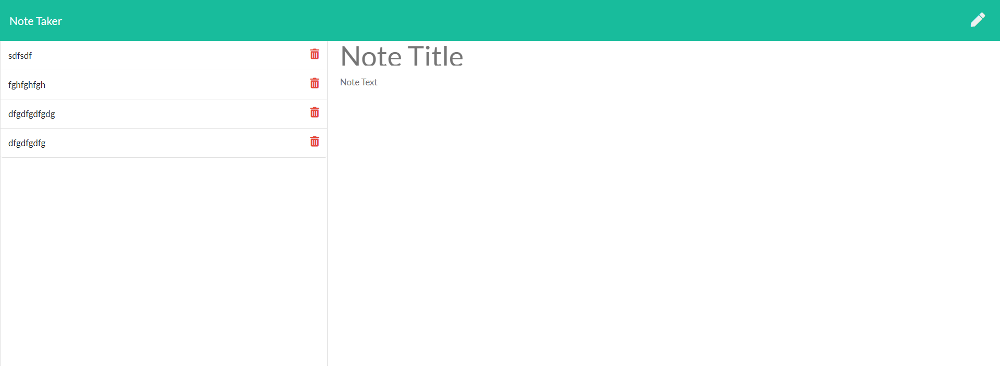

# Note Taker

 

  ## Description
  Note-Taker is an application that allows the use to write, save, and delete notes for whatever they want to use it for.

  ## Table of Contents
  * [Installation](#installation)
  * [Usage](#usage)
  * [Credits](#credits)
  * [License](#license)
  * [Contributing](#Contributing)
  * [Test](#test)
  * [Questions](#questions)
  
  ## Installation
  1. Clone repository into desired folder
  2. In the command line run: npm install and npm install express.
  3. To run this app on your computer run npm start to get the server running. Open http://localhost:3001 in your browser to use it.

  ## Usage
  

  ## Credits
  some help

  ## License
  This project is covered under the license of [MIT](https://www.opensource.org/licenses/mit-license.php).
  
  ## Contributing 
  be nice

  ## Test
  some instructions

  ## Questions
  You can contact to me at my GitHub profile, which is [Dmorrel7](https://github.com/Dmorrel7).
  You can also reach out to me by email daltonmorrel7@gmail.com